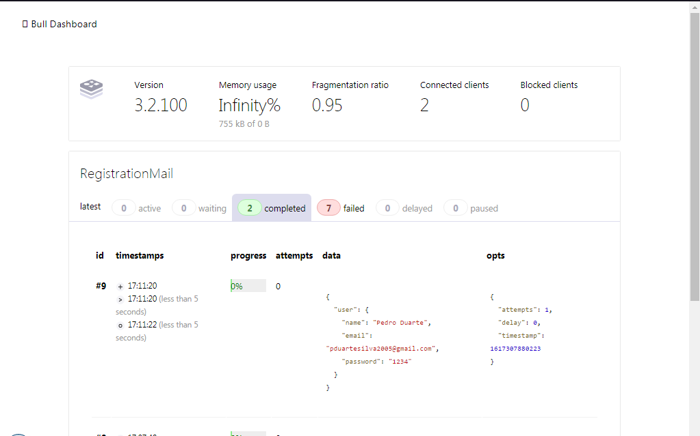

# Masterclass - QueueNode

## Projeto
QueueNode é uma API que trabalha com Background Jobs (filas) utilizando Node.js com Redis

## Tecnologias

- [Node.js](https://nodejs.org/en)
- 🐮 [Bull](https://github.com/OptimalBits/bull)
- [Redis](https://redis.io)

## 🔥 Como Começar

- 1 - Faça um clone desse repositório `git clone https://github.com/pduartesilva2005/masterclass-queuenode.git`;
- 2 - Entre na pasta `cd masterclass-queuenode`;
- 3 - Rode `yarn` para instalar as depenências;
- 4 - Copie o arquivo `.env.example` e crie um arquivo `.env` com as credenciais de email e do Redis; 
- 5 - Rode `yarn dev` para iniciar o servidor.

## ⚡️ Como contribuir

- Faça um fork desse repositório;
- Cria uma branch com a sua feature: `git checkout -b minha-feature`;
- Faça commit das suas alterações: `git commit -m 'feat: Minha nova feature'`;
- Faça push para a sua branch: `git push origin minha-feature`.

Depois que o merge da sua pull request for feito, você pode deletar a sua branch.

## 📝 Licença

Esse Projeto está sob a licença MIT. Veja o Arquivo [LICENSE](.github/LICENSE.md) para mais detalhes.

---

<a href="https://app.rocketseat.com.br/me/pedropduarte2005">
 
  
 <b>Pedro Duarte</b></a> <a href="https://app.rocketseat.com.br/me/pedropduarte2005" title="Rocketseat">🚀</a>

Feito com 💖 by Pedro Duarte

